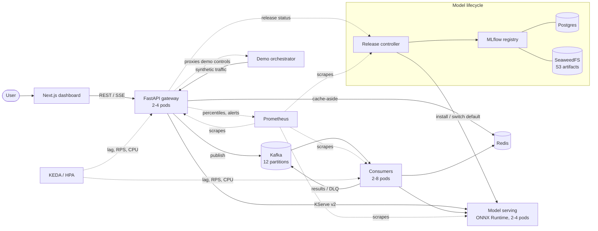
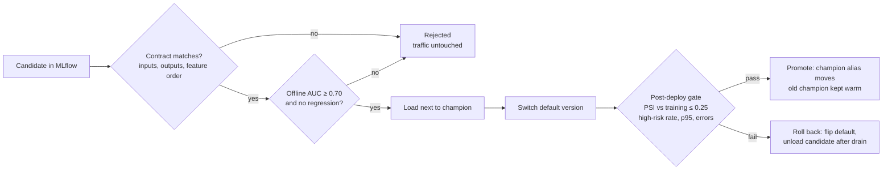

# StreamPredict

**English** | [中文](README.zh-CN.md)

> A real-time ML inference platform you can watch under pressure: bursty traffic is buffered and
> absorbed by autoscaling, model releases are gated and rolled back automatically, and every step
> is observable from one dashboard.

StreamPredict serves a fraud-risk model behind an API gateway, a Kafka event pipeline, a Redis
cache, and a versioned model server, then deploys the whole system on Kubernetes with lag-based
autoscaling, an MLflow-driven release controller, and Prometheus alerting. The model is
deliberately small; the point is the platform around it.


---

## Contents

- [What you can do with it](#what-you-can-do-with-it)
- [Problems it solves](#problems-it-solves)
- [Architecture](#architecture)
- [How it works](#how-it-works)
- [Results](#results)
- [Design decisions and tradeoffs](#design-decisions-and-tradeoffs)
- [Limitations and future work](#limitations-and-future-work)
- [Running it](#running-it)
- [Repository layout](#repository-layout)

## What you can do with it

From the dashboard, without a terminal:

1. **Predict:** submit a transaction and get a risk score, the serving model version, latency, and
   whether the Redis cache answered.
2. **Spike traffic:** start a bounded synthetic burst (≤ 100 RPS, ≤ 5 min, one session per
   cluster). Watch Kafka lag climb, KEDA scale consumers 2 → 4 → 8, throughput rise, and lag
   drain back to zero; afterwards replicas scale back down.
3. **Release a model:** promote a registered version from MLflow. A good version (v2) passes every
   gate and becomes champion. A subtly broken one (v3) looks identical offline, goes live, and is
   rolled back within about 10 seconds with no failed requests.
4. **Read the system:** cluster-wide RPS, p50/p95/p99, success rate, cache hit rate, prediction
   distribution, consumer lag, pod counts, CPU/memory, autoscaler state, release history, and
   firing Prometheus alerts.

## Problems it solves

| Problem | Why it is hard | What StreamPredict does |
| --- | --- | --- |
| **Bursty load** | Synchronous scoring falls over or drops work when traffic spikes. | Kafka buffers events; consumers scale on consumer-group lag (KEDA). The gateway also scales on CPU or Prometheus RPS. |
| **Silent model regressions** | Offline metrics are computed by the training pipeline, so they share its bugs. A model can pass every offline check and still be wrong in production (training/serving skew). | After switching traffic, the release controller scores production-like inputs and compares the output distribution with the model's *own* training-time distribution (PSI, high-risk rate, latency, errors). On failure it flips traffic back to the still-loaded previous champion. |
| **No duplicates, no lost events** | At-least-once delivery redelivers after crashes; malformed events block partitions. | Offsets are committed only after results are acknowledged, finished events are de-duplicated in Redis, poison records go to a dead-letter topic with context headers, and a bounded replay tool re-publishes them. |
| **Dependencies fail** | A slow cache or broker can take the API down with it. | Redis calls have ~50 ms timeouts and a circuit breaker (cache bypass, never an error); Kafka loss disables async events but not sync predictions; readiness reports `degraded` instead of failing. |
| **Many replicas, one truth** | Per-process state and metrics break once a service has replicas. | One demo orchestrator per cluster, request counts summed across gateways in Redis, latency percentiles from Prometheus over every replica, and model reloads fanned out to every serving pod. |
| **Traceability** | "Which model is live, where did it come from, why was it rolled back?" | Every version links to an MLflow run (parameters, metrics, data version, git commit, artifacts); every release attempt is an MLflow run with its outcome, reasons, and gate metrics. |

## Architecture



| Component | Responsibility | Technology |
| --- | --- | --- |
| Dashboard | Live view and controls; SSE with polling fallback | Next.js 16, React 19 |
| API gateway | Sync predictions, event ingestion, demo and release proxies, aggregated overview | FastAPI, Pydantic, httpx, aiokafka, redis-py |
| Redis | Prediction cache, cluster-wide request counters, event idempotency markers | Redis 7 (LRU, no persistence) |
| Kafka | `prediction-events` (12 partitions), `prediction-results`, dead-letter topic | Apache Kafka 4.3 (KRaft) |
| Consumers | Batch processing with retries, DLQ, idempotency, lag metrics | aiokafka |
| Model serving | Versioned ONNX models, dynamic batching, hot load/unload, Open Inference Protocol | ONNX Runtime, FastAPI |
| Release controller | Gated releases, traffic switch, automatic and manual rollback | MLflow client |
| MLflow + Postgres + SeaweedFS | Experiment tracking, model registry (`champion` alias), S3 artifacts | MLflow 3.16 |
| Demo orchestrator | Bounded synthetic load, session state machine, run summaries | Gateway image, separate entrypoint |
| Prometheus | Scrapes every replica; recording rules, 7 alerts | Prometheus 3.15, kube-state-metrics, cAdvisor |
| Kubernetes | Probes, PDBs, rolling updates, KEDA + HPA autoscaling | kind, KEDA 2.21, metrics-server |

## How it works

### Synchronous prediction

1. The gateway hashes the features into a cache key that includes the model version
   (`sp:v1:prediction:<model>:<version>:<sha256>`), so a release never serves stale scores.
2. Redis is checked with a ~50 ms timeout. On a miss, concurrent misses for the same key are
   coalesced into one inference call (stampede protection); TTLs are jittered to avoid synchronized
   expiry.
3. The gateway calls the model server's `/v2/models/<model>/versions/<v>/infer`. It follows the
   server's default version in the background, so promotions and rollbacks propagate within
   ~2 seconds, and it retries once if its pinned version was just unloaded.
4. The model returns a probability; risk thresholds (`low_risk` / `review` / `high_risk`) stay in
   the gateway so models can be swapped without changing business logic.

### Asynchronous events

1. `POST /api/v1/events` publishes a versioned event (`schema_version`, `event_id`, `request_id`,
   timestamps, features) with an idempotent producer (`acks=all`).
2. Consumers poll batches, skip event IDs already marked done, predict with bounded retries
   (exponential backoff for transient errors), and route failures to the dead-letter topic with
   the error code, source partition/offset, and attempt count in headers.
3. Results and dead letters are acknowledged by Kafka **before** offsets are committed and events
   are marked done, so a crash anywhere replays the batch without losing or duplicating results.
4. `python -m streampredict_consumer.replay` re-publishes dead letters. Each run stops at the
   offsets that existed when it started, so a still-broken event cannot loop.

### Model serving

- Model repository layout matches Triton/KServe: `<model>/config.json`, `<model>/<version>/model.onnx`,
  plus training metadata. Feature transforms and scaling are part of the ONNX graph.
- Each version gets its own ONNX Runtime session and a dynamic batcher (up to 64 rows or 2 ms
  queue delay) running on a dedicated worker thread, so the event loop never blocks.
- `serving.json` names the default version. The controller changes it; a rollback is a pointer
  flip with both versions already warm.

### Model lifecycle and release gates



The demo ships three versions: **v1** (baseline, AUC 0.72), **v2** (improved, AUC 0.78), and
**v3**, trained on amounts in *cents* while serving sends *dollars*. v3's offline AUC equals v2's
because its evaluation shares the bug; in production its high-risk rate collapses from 6.2 % to
0 % and the gate catches it. Every attempt is logged to the `streampredict-deployments` MLflow
experiment, and versions carry `status` / `status_reason` tags.

### Autoscaling

| Workload | Scaler | Range | Signal |
| --- | --- | --- | --- |
| Consumers | KEDA Kafka scaler | 2–8 | Group lag ÷ 50 per pod; may double every 15 s, scales down after 60 s stable |
| Gateway | KEDA (CPU + Prometheus) | 2–4 | CPU 70 % or 40 prediction RPS per pod |
| Model serving | HPA | 2–4 | CPU 70 % |

Consumers run with a deliberate 40 ms of simulated per-event work in the demo configuration, so a
100 RPS burst outruns two pods and the scaling is visible.

### Observability

- Bounded-label metrics in every service (`streampredict_<component>_<what>_<unit>`); catalog and
  conventions in [`docs/observability.md`](docs/observability.md).
- Prometheus discovers every pod by annotation; recording rules provide cluster p50/p95/p99.
- Alerts: target down, API error rate > 5 %, p95 > 150 ms, consumer lag > 1000, dead letters,
  release rolled back, no model loaded. Rules are unit-tested with `promtool`.
- The gateway's read-only service account lists deployments, HPAs, pod metrics, and rescale events
  for the dashboard's infrastructure panel.

## Results

Measured on a single-node kind cluster on a laptop (details in
[`docs/load-test.md`](docs/load-test.md)):

| Measurement | Result |
| --- | --- |
| Sync predictions, 100–400 RPS (open loop) | 100 % success, p50 ≈ 2 ms, p95 6.6–7.6 ms (target < 150 ms) |
| Redis lookup | p95 1.0 ms (target < 10 ms) |
| ONNX Runtime compute | p95 0.5 ms per batch |
| 100 RPS event burst | Lag peaked ≈ 900; consumers 2 → 4 → 8; throughput ≈ 50 → 180 events/s; lag back to 0, then scale-down |
| Faulty release (v3) under traffic | Detected (PSI 1.25, high-risk 0 % vs 6.2 % expected) and rolled back in ≈ 10 s; 3,240 requests, 0 errors |
| Good release (v2) | Promoted with PSI 0.003 |
| Event pipeline | 1,088 events → 1,088 results; broker test verifies exactly-once results, duplicate skipping, DLQ, and replay |
| Model-serving image | 434 MB (vs ≈ 20 GB for Triton) |
| Tests | 91 automated tests + Kafka broker test + promtool rule tests; lint and strict mypy on 68 files |

## Design decisions and tradeoffs

| Decision | Alternatives | Why | Cost |
| --- | --- | --- | --- |
| **Own ONNX Runtime server** speaking KServe v2 | TorchServe, Triton | TorchServe was archived in Aug 2025; Triton's image is ≈ 20 GB and its strengths (GPU, TensorRT, multi-framework) are unused here. Same protocol and repository layout, so swapping later is cheap. | Batching, versioning, and metrics are maintained in-house. |
| **ONNX** as the model format | TorchScript, pickled models | Framework-neutral (PyTorch, TF, sklearn export to it), tiny runtime, no PyTorch in serving images. | Some ops/models need export work. |
| **Gate against the candidate's own training distribution** | Compare with the previous champion | A better model legitimately produces a different distribution; comparing with the champion rolled back v2 in early testing. | Each model must record a score profile at training time. |
| **Post-deploy gate with instant rollback** | Shadow traffic or canary first | Simple, and the old version stays loaded so rollback is a pointer flip. | Real traffic sees the candidate for the ~10 s verification window. |
| **At-least-once + idempotency markers** | Kafka transactions (exactly-once) | Works across Kafka, Redis, and the model server; simpler to operate. | If Redis is down, a redelivered event can produce a duplicate result (never a lost one). |
| **KEDA for lag and RPS scaling** | Prometheus Adapter + custom metrics | One component for Kafka lag and Prometheus queries, with scaling behaviour per object. | Another operator; it caches failed broker connections (handled by ordering the deploy). |
| **SeaweedFS** for S3 artifacts | MinIO | MinIO's community edition was archived and its images are no longer published. | Less familiar to most teams. |
| **Redis counters for cluster RPS**, Prometheus for percentiles | Prometheus for everything | 1-second resolution for the live sparkline; Prometheus scrapes every 5 s. | Two sources; RPS is ~2 s behind real time. |
| **Single-replica demo orchestrator** | State in Redis shared by all gateways | One owner of session state, so the one-session limit holds without distributed locking. | It is a single point of failure for demos (not for predictions). |
| **Shared RWO volume for deployed models** | Object-store sync per serving pod | Simple and atomic on a single node. | Multi-node clusters need RWX storage or a sync sidecar. |
| **Business thresholds in the gateway** | Inside the model | Models can change without changing what "high risk" means. | Thresholds and model calibration must be kept consistent. |

## Limitations and future work

- **Online features are out of scope.** Features arrive with the request. The planned design keeps
  per-card sliding windows (e.g. events in the last hour) in Redis, updated by consumers and read
  at prediction time.
- **CI/CD and security hardening are deferred:** no GitHub Actions, image scanning, or API rate
  limiting yet; credentials in the manifests are development-only.
- **Local only:** measured on one laptop node, so the service ceiling was not reached (the load
  generator saturates first). No public deployment.
- **Synthetic data:** the demo model and traffic are synthetic, and consumers include simulated
  work in the autoscaling demo.
- **No Alertmanager routing or Grafana:** alerts surface on the dashboard and in Prometheus.

The roadmap with per-module acceptance criteria and progress is in
[`docs/roadmap.md`](docs/roadmap.md).

## Running it

Prerequisites: Conda, Docker (≈ 8 GB memory), Node.js 22; `kind` and `kubectl` for Kubernetes.

```bash
conda env create -f environment.yml && conda activate streampredict
make check          # lint, types, tests, dashboard build

make up             # Docker Compose: dashboard :3000, API :8000/docs, MLflow :5001, Prometheus :9090
make down

make k8s-up         # kind + metrics-server + KEDA, build, load, deploy (run `make down` first)
make k8s-status     # pods, autoscalers, rescale events
make k8s-prometheus # Prometheus UI on :9090
make k8s-down
```

More: [`docs/development.md`](docs/development.md) · runbooks for the
[event pipeline](docs/runbooks/kafka-event-pipeline.md),
[model releases](docs/runbooks/model-releases.md), and
[Kubernetes](docs/runbooks/kubernetes.md).

## Repository layout

```text
apps/dashboard/              Next.js dashboard
services/api/                FastAPI gateway (+ demo orchestrator entrypoint)
services/consumer/           Kafka consumer workers and DLQ replay
services/model-serving/      ONNX Runtime model server (KServe v2)
services/model-controller/   Release controller and registry seed job
ml/training/                 Demo model training (PyTorch → ONNX)
ml/registry/                 MLflow integration
ml/artifacts/                Committed demo model versions (seed the registry)
infra/docker/                Docker Compose stack
infra/kubernetes/            Manifests, autoscalers, deploy scripts
infra/prometheus/            Scrape configs, recording and alerting rules
tests/                       Unit, integration, broker, and load tests
docs/                        Roadmap, observability, load test, runbooks
```

## License

Not yet chosen.
