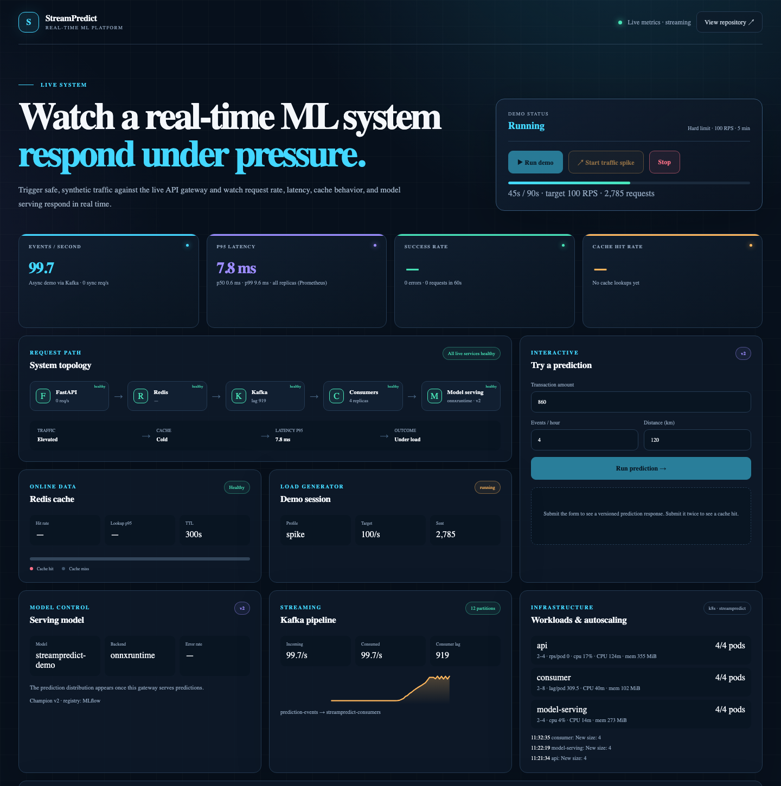
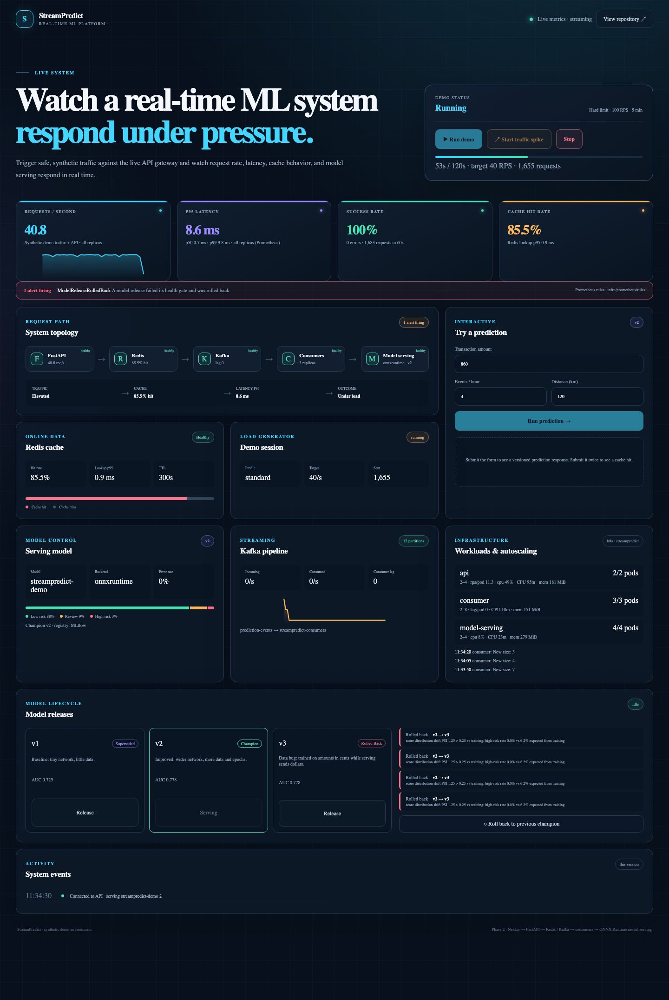
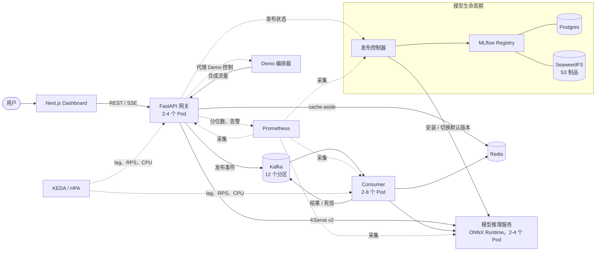
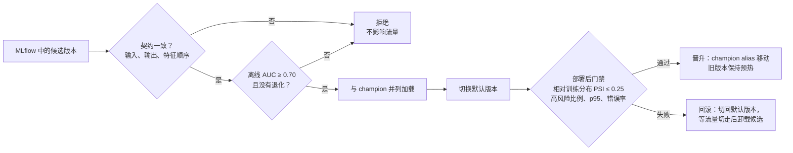

# StreamPredict

[English](README.md) | **中文**

> 一个能"看着它扛压力"的实时机器学习推理平台：突发流量先被缓冲、再由自动扩缩容消化；模型发布经过门禁检查，出问题自动回滚；每一步都能在同一个 Dashboard 上看到。

StreamPredict 把一个欺诈风险模型放在 API 网关、Kafka 事件管道、Redis 缓存和带版本管理的模型推理服务之后，再把整套系统部署到 Kubernetes 上，配合基于 lag 的自动扩缩容、由 MLflow 驱动的发布控制器和 Prometheus 告警。模型本身刻意保持简单，重点是承载模型的平台。





---

## 目录

- [能做什么](#能做什么)
- [解决了什么问题](#解决了什么问题)
- [架构](#架构)
- [怎么实现的](#怎么实现的)
- [结果](#结果)
- [设计决策与取舍](#设计决策与取舍)
- [局限与后续工作](#局限与后续工作)
- [运行](#运行)
- [仓库结构](#仓库结构)

## 能做什么

在 Dashboard 上，不需要命令行：

1. **实时预测**：提交一笔交易，得到风险分数、当前服务的模型版本、耗时，以及是否命中 Redis 缓存。
2. **制造流量尖峰**：启动一个有上限的合成流量（≤ 100 RPS、≤ 5 分钟、全集群同时只有一个 Session）。可以看到 Kafka lag 上升，KEDA 把 Consumer 从 2 扩到 4 再到 8，吞吐上升，lag 回落到 0，之后副本自动缩回。
3. **发布模型**：从 MLflow 选一个已注册的版本发布。好的版本（v2）通过所有门禁成为 champion；一个隐蔽有缺陷的版本（v3）离线看起来完全正常，上线后约 10 秒内被自动回滚，期间没有请求失败。
4. **读懂系统**：全集群 RPS、p50/p95/p99、成功率、缓存命中率、预测分布、Consumer lag、Pod 数、CPU/内存、自动扩缩容状态、发布历史，以及正在触发的 Prometheus 告警。

## 解决了什么问题

| 问题 | 难点 | StreamPredict 的做法 |
| --- | --- | --- |
| **突发流量** | 同步打分在流量尖峰时会被压垮或丢请求。 | Kafka 缓冲事件；Consumer 按消费组 lag 自动扩缩（KEDA）；网关也按 CPU 或 Prometheus 上的 RPS 扩缩。 |
| **模型悄悄变差** | 离线指标由训练流水线计算，会继承它的 bug。模型可能通过所有离线检查，上线后却是错的（训练/线上数据偏差）。 | 切流后，发布控制器用接近生产的输入打分，把输出分布和**该模型自己**在训练时的分布对比（PSI、高风险比例、延迟、错误率）。不通过就把流量切回仍在内存中的上一个 champion。 |
| **事件不重复、不丢失** | at-least-once 投递在崩溃后会重复投递；格式错误的事件会卡住分区。 | 结果被 Kafka 确认后才提交 offset；已处理的事件在 Redis 中去重；坏数据带着上下文进入 dead-letter topic，并有一个有边界的重放工具。 |
| **依赖会出故障** | 缓存或消息队列变慢，可能把 API 一起拖垮。 | Redis 调用约 50 ms 超时并带熔断（直接绕过缓存，不报错）；Kafka 不可用只停掉异步事件，不影响同步预测；就绪检查报告 `degraded` 而不是失败。 |
| **多副本下的一致性** | 一旦服务有多个副本，进程内的状态和指标就不准了。 | 全集群只有一个 Demo 编排器；各网关的请求数通过 Redis 汇总；延迟分位数来自 Prometheus 对所有副本的统计；模型加载通知会逐个发给每个推理副本。 |
| **可追溯** | "现在线上是哪个模型？它从哪来？为什么被回滚？" | 每个版本都关联一个 MLflow run（参数、指标、数据版本、Git commit、制品）；每次发布尝试也是一个 MLflow run，记录结果、原因和门禁指标。 |

## 架构



| 组件 | 职责 | 技术 |
| --- | --- | --- |
| Dashboard | 实时视图与控制；SSE，失败时退回轮询 | Next.js 16、React 19 |
| API 网关 | 同步预测、事件接入、Demo 与发布代理、汇总概览 | FastAPI、Pydantic、httpx、aiokafka、redis-py |
| Redis | 预测缓存、全集群请求计数、事件幂等标记 | Redis 7（LRU，不持久化） |
| Kafka | `prediction-events`（12 分区）、`prediction-results`、dead-letter topic | Apache Kafka 4.3（KRaft） |
| Consumer | 批量处理、重试、死信、幂等、lag 指标 | aiokafka |
| 模型推理服务 | 版本化 ONNX 模型、动态 batching、热加载/卸载、Open Inference Protocol | ONNX Runtime、FastAPI |
| 发布控制器 | 门禁发布、切流、自动与手动回滚 | MLflow client |
| MLflow + Postgres + SeaweedFS | 实验追踪、模型注册（`champion` alias）、S3 制品存储 | MLflow 3.16 |
| Demo 编排器 | 有上限的合成流量、Session 状态机、运行摘要 | 与网关同镜像，独立入口 |
| Prometheus | 采集每个副本；记录规则、7 条告警 | Prometheus 3.15、kube-state-metrics、cAdvisor |
| Kubernetes | 健康检查、PDB、滚动更新、KEDA + HPA 自动扩缩容 | kind、KEDA 2.21、metrics-server |

## 怎么实现的

### 同步预测

1. 网关把特征哈希成缓存 key，key 中包含模型版本（`sp:v1:prediction:<模型>:<版本>:<sha256>`），所以发布新版本后不会返回旧模型的分数。
2. 以约 50 ms 超时查询 Redis。未命中时，同一个 key 的并发请求只触发一次推理（防缓存击穿）；TTL 加随机抖动，避免同时过期。
3. 网关调用推理服务的 `/v2/models/<模型>/versions/<版本>/infer`。它在后台跟随推理服务的默认版本，因此晋升和回滚约 2 秒内生效；如果固定的版本刚被卸载，会立即刷新并重试一次。
4. 模型只返回概率；风险阈值（`low_risk` / `review` / `high_risk`）保留在网关，换模型不需要改业务逻辑。

### 异步事件

1. `POST /api/v1/events` 用幂等 producer（`acks=all`）发布带版本的事件（`schema_version`、`event_id`、`request_id`、时间戳、特征）。
2. Consumer 批量拉取，跳过已标记完成的 event ID，带有限次重试（瞬时错误指数退避）进行预测；失败的事件进入 dead-letter topic，header 中带错误码、来源分区/offset 和尝试次数。
3. 结果和死信**先**被 Kafka 确认，**再**提交 offset、标记完成。所以任何位置崩溃都会重放这一批，结果既不丢也不重复。
4. `python -m streampredict_consumer.replay` 重放死信。每次只处理启动时已存在的记录，仍然有问题的事件不会无限循环。

### 模型推理服务

- 模型仓库目录与 Triton/KServe 一致：`<模型>/config.json`、`<模型>/<版本>/model.onnx`，以及训练元数据。特征变换和标准化都打包在 ONNX 计算图里。
- 每个版本有独立的 ONNX Runtime session 和动态 batcher（最多 64 行或等待 2 ms），在专用线程上运行，不阻塞事件循环。
- `serving.json` 指定默认版本，由发布控制器修改；回滚就是切一下这个指针，两个版本都已经在内存中预热好。

### 模型生命周期与发布门禁



Demo 带三个版本：**v1**（基线，AUC 0.72）、**v2**（改进版，AUC 0.78），以及 **v3**：它训练时把金额当作"分"，而线上传的是"元"。v3 的评估继承了同一个 bug，所以离线 AUC 和 v2 一样；但上线后高风险比例从 6.2% 掉到 0%，被门禁拦下。每次发布尝试都记录在 MLflow 的 `streampredict-deployments` 实验中，版本上带有 `status` / `status_reason` 标签。

### 自动扩缩容

| 服务 | 扩缩器 | 范围 | 依据 |
| --- | --- | --- | --- |
| Consumer | KEDA Kafka scaler | 2–8 | 消费组 lag ÷ 每 Pod 50；每 15 秒最多翻倍，稳定 60 秒后缩容 |
| 网关 | KEDA（CPU + Prometheus） | 2–4 | CPU 70% 或每 Pod 40 预测 RPS |
| 模型推理服务 | HPA | 2–4 | CPU 70% |

Demo 配置中 Consumer 每处理一个事件会刻意多花 40 ms（模拟慢的下游依赖），这样 100 RPS 的突发流量才能超过 2 个 Pod 的处理能力，扩容过程才看得见。

### 可观测性

- 每个服务都暴露 label 有界的指标（`streampredict_<组件>_<内容>_<单位>`）；指标目录和约定见 [`docs/observability.md`](docs/observability.md)。
- Prometheus 通过 annotation 自动发现每个 Pod；记录规则提供全集群 p50/p95/p99。
- 告警：服务下线、API 错误率 > 5%、p95 > 150 ms、Consumer lag > 1000、出现死信、模型发布回滚、没有加载任何模型。规则用 `promtool` 做了单元测试。
- 网关的只读 ServiceAccount 读取 Deployment、HPA、Pod 资源和扩缩容事件，供 Dashboard 的基础设施面板使用。

## 结果

在笔记本上的单节点 kind 集群中测得（详见 [`docs/load-test.md`](docs/load-test.md)）：

| 测量项 | 结果 |
| --- | --- |
| 同步预测，100–400 RPS（开环压测） | 成功率 100%，p50 约 2 ms，p95 6.6–7.6 ms（目标 < 150 ms） |
| Redis 查询 | p95 1.0 ms（目标 < 10 ms） |
| ONNX Runtime 计算 | 每批 p95 0.5 ms |
| 100 RPS 事件突发 | lag 峰值约 900；Consumer 2 → 4 → 8；吞吐约 50 → 180 事件/秒；lag 回到 0 后自动缩容 |
| 带流量发布缺陷版本（v3） | 被检测到（PSI 1.25，高风险比例 0%，预期 6.2%），约 10 秒回滚；3,240 个请求 0 错误 |
| 发布正常版本（v2） | PSI 0.003，通过并晋升 |
| 事件管道 | 1,088 个事件 → 1,088 个结果；真实 broker 测试验证结果恰好一次、重复投递跳过、死信与重放 |
| 推理服务镜像 | 434 MB（Triton 约 20 GB） |
| 测试 | 91 个自动化测试 + Kafka broker 测试 + promtool 规则测试；68 个文件通过 lint 和严格 mypy |

## 设计决策与取舍

| 决策 | 备选方案 | 理由 | 代价 |
| --- | --- | --- | --- |
| **自研 ONNX Runtime 推理服务**，兼容 KServe v2 | TorchServe、Triton | TorchServe 已于 2025 年 8 月归档；Triton 镜像约 20 GB，它的优势（GPU、TensorRT、多框架）这里用不上。协议和仓库目录一致，以后切换成本低。 | batching、版本管理和指标需要自己维护。 |
| **ONNX** 作为模型格式 | TorchScript、pickle | 与训练框架无关（PyTorch、TF、sklearn 都能导出），运行时小，推理镜像不需要 PyTorch。 | 部分算子和模型需要额外的导出工作。 |
| **对比候选版本自己的训练分布** | 与上一个 champion 对比 | 更好的模型本来就会产生不同的分布；早期测试中和 champion 对比，导致 v2 被误回滚。 | 每个模型训练时必须记录分数分布。 |
| **部署后门禁 + 即时回滚** | 先做影子流量或金丝雀 | 简单；旧版本一直在内存中，回滚只是切指针。 | 验证窗口（约 10 秒）内真实流量会经过候选版本。 |
| **at-least-once + 幂等标记** | Kafka 事务（exactly-once） | 能跨 Kafka、Redis 和推理服务生效，运维更简单。 | Redis 宕机时，重复投递可能产生重复结果（但不会丢失）。 |
| **用 KEDA 做 lag 和 RPS 扩缩** | Prometheus Adapter + 自定义指标 | 一个组件同时支持 Kafka lag 和 Prometheus 查询，每个对象可单独配置扩缩行为。 | 多一个 operator；它会缓存失败的 broker 连接（通过调整部署顺序解决）。 |
| **SeaweedFS** 存制品 | MinIO | MinIO 社区版已归档，不再发布镜像。 | 多数团队对它不如 MinIO 熟悉。 |
| **全集群 RPS 用 Redis 计数**，分位数用 Prometheus | 全部用 Prometheus | 实时曲线需要 1 秒粒度，Prometheus 每 5 秒采集一次。 | 两个数据源；RPS 比实时约慢 2 秒。 |
| **单副本 Demo 编排器** | 状态存 Redis，所有网关共享 | 只有一个 Session 状态的所有者，不需要分布式锁就能保证同时只有一个 Demo。 | 它是 Demo 功能的单点（不影响预测）。 |
| **用共享 RWO 卷存放已部署模型** | 每个推理 Pod 从对象存储同步 | 单节点上简单且原子。 | 多节点集群需要 RWX 存储或同步 sidecar。 |
| **业务阈值放在网关** | 放在模型内部 | 换模型不改变"高风险"的定义。 | 阈值和模型校准需要保持一致。 |

## 局限与后续工作

- **在线特征不在本期范围**：特征目前随请求传入。规划中的设计是在 Redis 中按卡号维护滑动窗口（如最近一小时交易次数），由 Consumer 更新，预测时读取。
- **CI/CD 与安全加固暂缓**：还没有 GitHub Actions、镜像扫描和 API 限流；部署配置中的凭据仅用于开发。
- **只在本地运行**：在单台笔记本节点上测量，没有测出服务上限（压测程序先饱和）；没有公开部署。
- **合成数据**：Demo 模型和流量都是合成的，自动扩缩容 Demo 中 Consumer 带有模拟的处理耗时。
- **没有 Alertmanager 通知和 Grafana**：告警显示在 Dashboard 和 Prometheus 中。

带各模块验收条件和进度的路线图见 [`docs/roadmap.md`](docs/roadmap.md)。

## 运行

依赖：Conda、Docker（约 8 GB 内存）、Node.js 22；Kubernetes 部分还需要 `kind` 和 `kubectl`。

```bash
conda env create -f environment.yml && conda activate streampredict
make check          # lint、类型检查、测试、Dashboard 构建

make up             # Docker Compose：Dashboard :3000、API :8000/docs、MLflow :5001、Prometheus :9090
make down

make k8s-up         # kind + metrics-server + KEDA，构建、加载并部署（先运行 make down）
make k8s-status     # Pod、自动扩缩容、扩缩容事件
make k8s-prometheus # Prometheus UI，端口 9090
make k8s-down
```

更多：[`docs/development.md`](docs/development.md)，以及
[事件管道](docs/runbooks/kafka-event-pipeline.md)、
[模型发布](docs/runbooks/model-releases.md)、
[Kubernetes](docs/runbooks/kubernetes.md) 运维手册。

## 仓库结构

```text
apps/dashboard/              Next.js Dashboard
services/api/                FastAPI 网关（含 Demo 编排器入口）
services/consumer/           Kafka Consumer 与死信重放
services/model-serving/      ONNX Runtime 推理服务（KServe v2）
services/model-controller/   发布控制器与 Registry 初始化任务
ml/training/                 Demo 模型训练（PyTorch → ONNX）
ml/registry/                 MLflow 集成
ml/artifacts/                已提交的 Demo 模型版本（用于初始化 Registry）
infra/docker/                Docker Compose
infra/kubernetes/            部署配置、自动扩缩容、部署脚本
infra/prometheus/            采集配置、记录与告警规则
tests/                       单元、集成、broker 与负载测试
docs/                        路线图、可观测性、负载测试、运维手册
```

## License

尚未确定。
